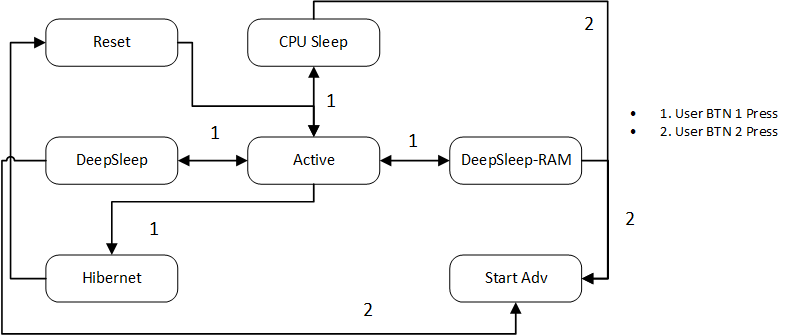
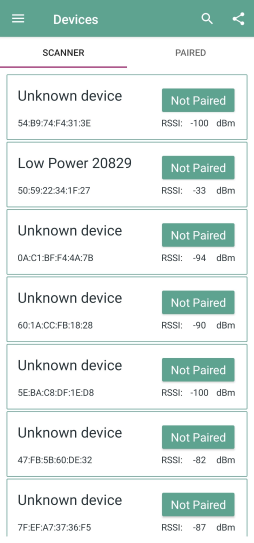
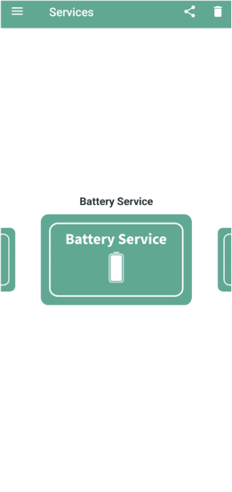
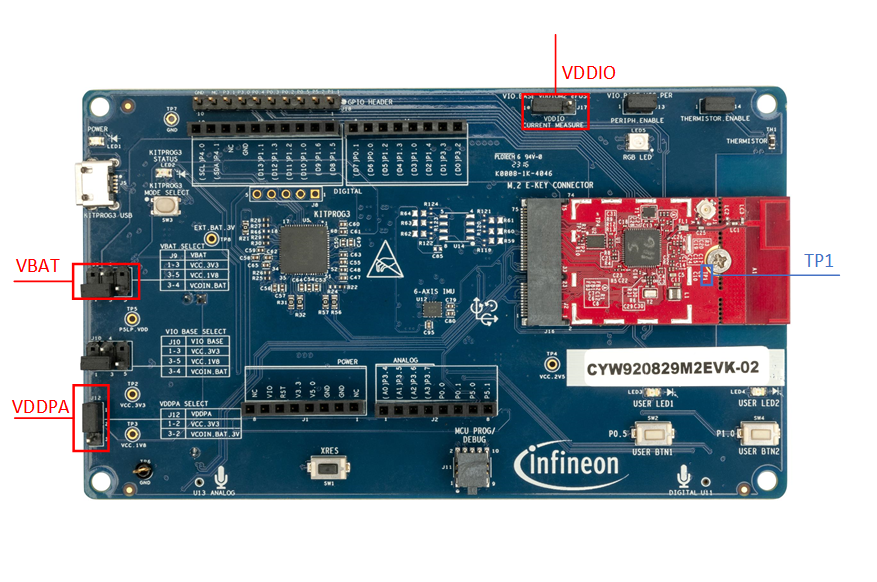
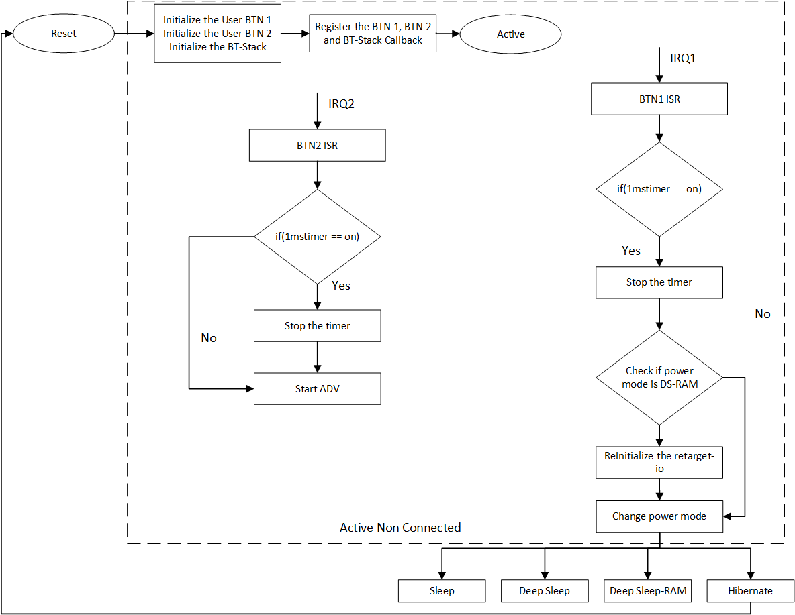

# AIROC&trade; CYW20829 Free RTOS switching power modes

This code example demonstrates how to transition AIROC&trade; CYW20829 MCU between the following power modes:

- Active
- Sleep
- DeepSleep
- DeepSleep-RAM
- Hibernate

[View this README on GitHub.](https://github.com/Infineon/mtb-example-btstack-freertos-cyw20829-switching-power-modes)

[Provide feedback on this code example.](https://cypress.co1.qualtrics.com/jfe/form/SV_1NTns53sK2yiljn?Q_EED=eyJVbmlxdWUgRG9jIElkIjoiQ0UyMzkxNzkiLCJTcGVjIE51bWJlciI6IjAwMi0zOTE3OSIsIkRvYyBUaXRsZSI6IkFJUk9DJnRyYWRlOyBDWVcyMDgyOSBGcmVlIFJUT1Mgc3dpdGNoaW5nIHBvd2VyIG1vZGVzIiwicmlkIjoieWFra3VuZGkiLCJEb2MgdmVyc2lvbiI6IjEuMC4wIiwiRG9jIExhbmd1YWdlIjoiRW5nbGlzaCIsIkRvYyBEaXZpc2lvbiI6Ik1DRCIsIkRvYyBCVSI6IklDVyIsIkRvYyBGYW1pbHkiOiJCVEFCTEUifQ==)

## Overview

This code example shows how to change the following power modes of the devices.
- Active to Sleep
- Active to DeepSleep
- Active to DeepSleep-RAM
- Active to Hibernate

The code example uses the user button 1 (User BTN 1) to change the power modes. After the system goes to Hibernate mode, it waits for the wakeup sources, User button 2 (User BTN 2) to start the advertisement. This code example shows user button 1 as a wakeup source. **Figure 1** shows the state machine implemented in the firmware to execute the transitions.

**Figure 1. Switching power mode software state machine**



## Requirements

- [ModusToolbox&trade;](https://www.infineon.com/modustoolbox) v3.0 or later (tested with v3.0)
- Board support package (BSP) minimum required version: 1.0.1
   - CYW920829M2EVK-02: 1.0.1
- Programming language: C
- Associated parts: [AIROC&trade; CYW20829 Bluetooth&reg; LE SoC](https://www.infineon.com/cms/en/product/promopages/airoc20829)

## Supported toolchains (make variable 'TOOLCHAIN')

- GNU Arm&reg; Embedded Compiler  v10.3.1 (`GCC_ARM`) – Default value of `TOOLCHAIN`

## Supported kits (make variable 'TARGET')

- AIROC&trade; CYW20829 Bluetooth&reg; LE Evaluation Kit (`CYW920829M2EVK-02`) – Default value of `TARGET`


## Hardware setup

For hardware configuration to use WCO, see [Release Notes](https://www.infineon.com/dgdl/Infineon-CYW920829M2EVK-02_Evaluation_Kit_release_notes-UserManual-v01_00-EN.pdf?fileId=8ac78c8c8afe5bd0018b10a8eefb1d53).


> **Note:** The AIROC&trade; CYW20829 Bluetooth&reg; Kit (CYW920829M2EVK-02) ships with KitProg3 version 2.21 installed. ModusToolbox&trade; requires KitProg3 with the latest version 2.40. Before using this code example, make sure that the board is upgraded to KitProg3. The tool and instructions are available in the [Firmware Loader](https://github.com/Infineon/Firmware-loader) GitHub repository. If you do not upgrade, you will see an error like "unable to find CMSIS-DAP device" or "KitProg firmware is out of date".

## Software setup

To view the battery level in Battery Service, scan the following QR code from your Android or iOS mobile device to download the AIROC&trade; Bluetooth&reg; Connect App.

**Figure 2. QR codes**


Install a terminal emulator if you don't have one. Instructions in this document use [Tera Term](https://ttssh2.osdn.jp/index.html.en).


## Using the code example

### Create the project

The ModusToolbox&trade; tools package provides the Project Creator as both a GUI tool and a command line tool.

<details><summary><b>Use Project Creator GUI</b></summary>

1. Open the Project Creator GUI tool.

   There are several ways to do this, including launching it from the dashboard or from inside the Eclipse IDE. For more details, see the [Project Creator user guide](https://www.infineon.com/ModusToolboxProjectCreator) (locally available at *{ModusToolbox&trade; install directory}/tools_{version}/project-creator/docs/project-creator.pdf*).

2. On the **Choose Board Support Package (BSP)** page, select a kit supported by this code example. See [Supported kits](#supported-kits-make-variable-target).

   > **Note:** To use this code example for a kit not listed here, you may need to update the source files. If the kit does not have the required resources, the application may not work.

3. On the **Select Application** page:

   a. Select the **Applications(s) Root Path** and the **Target IDE**.

   > **Note:** Depending on how you open the Project Creator tool, these fields may be pre-selected for you.

   b.	Select this code example from the list by enabling its check box.

   > **Note:** You can narrow the list of displayed examples by typing in the filter box.

   c. (Optional) Change the suggested **New Application Name** and **New BSP Name**.

   d. Click **Create** to complete the application creation process.

</details>

<details><summary><b>Use Project Creator CLI</b></summary>

The 'project-creator-cli' tool can be used to create applications from a CLI terminal or from within batch files or shell scripts. This tool is available in the *{ModusToolbox&trade; install directory}/tools_{version}/project-creator/* directory.

Use a CLI terminal to invoke the 'project-creator-cli' tool. On Windows, use the command-line 'modus-shell' program provided in the ModusToolbox&trade; installation instead of a standard Windows command-line application. This shell provides access to all ModusToolbox&trade; tools. You can access it by typing "modus-shell" in the search box in the Windows menu. In Linux and macOS, you can use any terminal application.

The following example clones the "[mtb-example-btstack-freertos-cyw20829-switching-power-modes](https://github.com/Infineon/mtb-example-btstack-freertos-cyw20829-switching-power-modes)" application with the desired name "LowPower20829" configured for the *CYW920829M2EVK-02* BSP into the specified working directory, *C:/mtb_projects*:

   ```
   project-creator-cli --board-id CYW920829M2EVK-02 --app-id mtb-example-btstack-freertos-cyw20829-switching-power-modes --user-app-name LowPower20829 --target-dir "C:/mtb_projects"
   ```


The 'project-creator-cli' tool has the following arguments:

Argument | Description | Required/optional
---------|-------------|-----------
`--board-id` | Defined in the <id> field of the [BSP](https://github.com/Infineon?q=bsp-manifest&type=&language=&sort=) manifest | Required
`--app-id`   | Defined in the <id> field of the [CE](https://github.com/Infineon?q=ce-manifest&type=&language=&sort=) manifest | Required
`--target-dir`| Specify the directory in which the application is to be created if you prefer not to use the default current working directory | Optional
`--user-app-name`| Specify the name of the application if you prefer to have a name other than the example's default name | Optional

> **Note:** The project-creator-cli tool uses the `git clone` and `make getlibs` commands to fetch the repository and import the required libraries. For details, see the "Project creator tools" section of the [ModusToolbox&trade; tools package user guide](https://www.infineon.com/ModusToolboxUserGuide) (locally available at {ModusToolbox&trade; install directory}/docs_{version}/mtb_user_guide.pdf).

</details>


### Open the project


After the project has been created, you can open it in your preferred development environment.


<details><summary><b>Eclipse IDE</b></summary>

If you opened the Project Creator tool from the included Eclipse IDE, the project will open in Eclipse automatically.

For more details, see the [Eclipse IDE for ModusToolbox&trade; user guide](https://www.infineon.com/MTBEclipseIDEUserGuide) (locally available at *{ModusToolbox&trade; install directory}/docs_{version}/mt_ide_user_guide.pdf*).

</details>


<details><summary><b>Visual Studio (VS) Code</b></summary>

Launch VS Code manually, and then open the generated *{project-name}.code-workspace* file located in the project directory.

For more details, see the [Visual Studio Code for ModusToolbox&trade; user guide](https://www.infineon.com/MTBVSCodeUserGuide) (locally available at *{ModusToolbox&trade; install directory}/docs_{version}/mt_vscode_user_guide.pdf*).

</details>


<details><summary><b>Keil µVision</b></summary>

Double-click the generated *{project-name}.cprj* file to launch the Keil µVision IDE.

For more details, see the [Keil µVision for ModusToolbox&trade; user guide](https://www.infineon.com/MTBuVisionUserGuide) (locally available at *{ModusToolbox&trade; install directory}/docs_{version}/mt_uvision_user_guide.pdf*).

</details>


<details><summary><b>IAR Embedded Workbench</b></summary>

Open IAR Embedded Workbench manually, and create a new project. Then select the generated *{project-name}.ipcf* file located in the project directory.

For more details, see the [IAR Embedded Workbench for ModusToolbox&trade; user guide](https://www.infineon.com/MTBIARUserGuide) (locally available at *{ModusToolbox&trade; install directory}/docs_{version}/mt_iar_user_guide.pdf*).

</details>


<details><summary><b>Command line</b></summary>

If you prefer to use the CLI, open the appropriate terminal, and navigate to the project directory. On Windows, use the command-line 'modus-shell' program; on Linux and macOS, you can use any terminal application. From there, you can run various `make` commands.

For more details, see the [ModusToolbox&trade; tools package user guide](https://www.infineon.com/ModusToolboxUserGuide) (locally available at *{ModusToolbox&trade; install directory}/docs_{version}/mtb_user_guide.pdf*).

</details>


## Operation


### Battery Service

1. Connect the board to your PC using the provided USB cable through the KitProg3 USB connector.

2. Open a terminal program and select the KitProg3 COM port. Set the serial port parameters to the following settings.

   Baud rate: 115200 bps; Data: 8 bits; Parity: None; Stop: 1 bit; Flow control: None; New line for receive data: Line Feed(LF) or Auto setting

3. Program the board using one of the following:

   <details><summary><b>Using Eclipse IDE</b></summary>

      1. Select the application project in the Project Explorer.

      2. In the **Quick Panel**, scroll down, and click **\<Application Name> Program (KitProg3_MiniProg4)**.
   </details>


   <details><summary><b>In other IDEs</b></summary>

   Follow the instructions in your preferred IDE.
   </details>


   <details><summary><b>Using CLI</b></summary>

     From the terminal, execute the `make program` command to build and program the application using the default toolchain to the default target. The default toolchain is specified in the application's Makefile but you can override this value manually:
      ```
      make program TOOLCHAIN=<toolchain>
      ```

      Example:

      ```
      make program TOOLCHAIN=GCC_ARM
      ```

      > **Note**:  Before building the application, ensure that the *bsps* folder contains the BSP files in *TARGET_APP_xxx* folder. If the files ae missing, use the library manager to add the same. You can invoke the Library Manager GUI tool from the terminal using `make library-manager` command or use the Library Manager CLI tool "library-manager-cli" to add/change the BSP.


     </details>

4. After programming, the application starts automatically. Observe the messages on the UART terminal, and wait for the device to make all the required connections.

#### **Test using the AIROC&trade; Bluetooth&reg; Connect mobile app**

1. Turn ON Bluetooth&reg; on your Android or iOS device.

2. Launch the AIROC&trade; Bluetooth&reg; Connect mobile app.

3. Press user button 1 on the kit to change the idle power mode.

4. Press user button 2 on the kit to start Bluetooth&reg; LE advertisements. Advertising will stop after 120 seconds if a connection has not been established.

5. Swipe down on the AIROC&trade; Bluetooth&reg; Connect app home screen to start scanning for Bluetooth&reg; LE peripherals; your device appears on the AIROC&trade; Bluetooth&reg; Connect app home screen. Select your device to establish a Bluetooth&reg; LE connection (see Figure 3).

   **Figure 3. AIROC&trade; Bluetooth&reg; Connect app device discovery**

   

6. Select Battery Service (see Figure 4) from the carousel view to check the battery levels. Tap **START NOTIFY** to get notifications of the changing battery level.

   **Figure 4. AIROC&trade; Bluetooth&reg; Connect Battery Service app**

   


   **Figure 5. Battery level**

   

7. Use the KitProg3 COM port to view the Bluetooth&reg; stack and application trace messages in the terminal window.

8. Measure the current consumption on required power rails as shown in Figure 6.


   **Figure 6. Power rails**

   

## Debugging


You can debug the example to step through the code.


<details><summary><b>In Eclipse IDE</b></summary>

Use the **\<Application Name> Debug (KitProg3_MiniProg4)** configuration in the **Quick Panel**. For details, see the "Program and debug" section in the [Eclipse IDE for ModusToolbox&trade; user guide](https://www.infineon.com/MTBEclipseIDEUserGuide).

> **Note:** By default P1_0, P1_1, P1_2, and P1_3 are used for Boot ROM JTAG activity, so we get spurious interrupts at `P1.0` which is also configured as user button 2. To avoid these false interrupts, disable the debug mode before entering into DS-RAM by updating the second argument as `false` in `Cy_Syslib_SetWarmBootEntryPoint()`.

</details>


<details><summary><b>In other IDEs</b></summary>

Follow the instructions in your preferred IDE.
</details>


## Design and implementation


The code example implements a Free RTOS Switching Power Modes with LE Battery Server application.
This example configures the user button 1 to switch the power modes and user button 2 to start the Bluetooth&reg; advertisements.The firmware implements the state machine shown in the [Overview](#overview) section.

Battery Service is used to simulate the battery level, which changes continuously from 100 percent to 0 percent in steps of 2 percent. On reaching zero, it rolls back and starts from 100 again. The code example also has a periodic timer which sends battery level as a notification to the client.

**Figure 7. Active disconnected**



**Figure 8. Active connected**


**Table 1.  CYW20829 current in different modes PILO with 3 V**

 Power modes  | Connection idle  |  Disconnection idle   
 :-------     |:------------     | :------------      
MCUSS Sleep   |2.1 mA            |2 mA
DeepSleep     |22.7 uA           |7.7 uA
DeepSleep-RAM |21.3 uA           |7.3 uA
Hibernate     |NA                |2.1 uA

<br>

**Table 2.  CYW20829 current in different modes WCO with 3 V**

 Power modes  | Connection idle  |  Disconnection idle   
 :-------     |:------------     | :------------      
MCUSS Sleep   |2.1 mA            | 2 mA
DeepSleep     |21.9 uA           |6.8 uA
DeepSleep-RAM |19.8 uA           |6.3 uA
Hibernate     |NA                |2.1 uA

<br>

> **Note:** **Table 1** and **Table 2** show the cumulative power consumption of VBAT, VDDPA, and VDDIO power rails and the voltage across the TP1 will be 0.9 V when the device is in DeepSleep mode. When CYW920829M2EVK-02 external flash is connected to VDDIO and voltage regulator, the measured current on VDDIO may depend on the selected external serial flash and voltage regulator.


### Resources and settings

This section explains the ModusToolbox&trade; resources and their configuration as used in this code example. Note that all the configuration explained in this section has already been done in the code example. ModusToolbox&trade; stores the configuration settings of the application in the *design.modus* file. This file is used by the graphical configurators, which generate the configuration firmware. This firmware is stored in the application’s *GeneratedSource* folder.

- **Device configurator:** The device configurator is used to enable/configure the peripherals and the pins used in the application. See the
[Device configurator guide](https://www.infineon.com/ModusToolboxDeviceConfig).

- **Bluetooth&reg; Configurator:** The Bluetooth&reg; Configurator is used for generating/modifying the Bluetooth&reg; LE GATT database. See the [Bluetooth Configurator guide](https://www.infineon.com/ModusToolboxBLEConfig).

## Related resources

Resources  | Links
-----------|----------------------------------
Code examples  | [Using ModusToolbox&trade;](https://github.com/Infineon/Code-Examples-for-ModusToolbox-Software) on GitHub
Device documentation | [AIROC&trade; CYW20829 Bluetooth&reg; LE SoC](https://www.infineon.com/cms/en/product/promopages/airoc20829)
Development kits | Select your kits from the [Evaluation board finder](https://www.infineon.com/cms/en/design-support/finder-selection-tools/product-finder/evaluation-board)
Libraries on GitHub | [core-lib](https://github.com/Infineon/core-lib) – Core library <br> [core-make](https://github.com/Infineon/core-make) – Core GNU make build system <br> [mtb-hal-cat1](https://github.com/Infineon/mtb-hal-cat1) – Hardware Abstraction Layer (HAL) library <br> [mtb-pdl-cat1](https://github.com/Infineon/mtb-pdl-cat1) – Peripheral Driver Library (PDL) <br> [retarget-io](https://github.com/Infineon/retarget-io) – Utility library to retarget STDIO messages to a UART port
Tools  | [ModusToolbox&trade;](https://www.infineon.com/modustoolbox) – ModusToolbox&trade; software is a collection of easy-to-use libraries and tools enabling rapid development with Infineon MCUs for applications ranging from wireless and cloud-connected systems, edge AI/ML, embedded sense and control, to wired USB connectivity using PSoC&trade; Industrial/IoT MCUs, AIROC&trade; Wi-Fi and Bluetooth&reg; connectivity devices, XMC&trade; Industrial MCUs, and EZ-USB&trade;/EZ-PD&trade; wired connectivity controllers. ModusToolbox&trade; incorporates a comprehensive set of BSPs, HAL, libraries, configuration tools, and provides support for industry-standard IDEs to fast-track your embedded application development.

<br>

## Other resources

Infineon provides a wealth of data at [www.infineon.com](https://www.infineon.com) to help you select the right device, and quickly and effectively integrate it into your design.


## Document history

Document title: *CE239179* – *CYW20829 Free RTOS switching power modes*

 Version | Description of change 
 ------- | --------------------- 
 1.0.0   | New code example      
<br>

All referenced product or service names and trademarks are the property of their respective owners.

The Bluetooth&reg; word mark and logos are registered trademarks owned by Bluetooth SIG, Inc., and any use of such marks by Infineon is under license.


---------------------------------------------------------

© Cypress Semiconductor Corporation, 2023. This document is the property of Cypress Semiconductor Corporation, an Infineon Technologies company, and its affiliates ("Cypress").  This document, including any software or firmware included or referenced in this document ("Software"), is owned by Cypress under the intellectual property laws and treaties of the United States and other countries worldwide.  Cypress reserves all rights under such laws and treaties and does not, except as specifically stated in this paragraph, grant any license under its patents, copyrights, trademarks, or other intellectual property rights.  If the Software is not accompanied by a license agreement and you do not otherwise have a written agreement with Cypress governing the use of the Software, then Cypress hereby grants you a personal, non-exclusive, nontransferable license (without the right to sublicense) (1) under its copyright rights in the Software (a) for Software provided in source code form, to modify and reproduce the Software solely for use with Cypress hardware products, only internally within your organization, and (b) to distribute the Software in binary code form externally to end users (either directly or indirectly through resellers and distributors), solely for use on Cypress hardware product units, and (2) under those claims of Cypress's patents that are infringed by the Software (as provided by Cypress, unmodified) to make, use, distribute, and import the Software solely for use with Cypress hardware products.  Any other use, reproduction, modification, translation, or compilation of the Software is prohibited.
<br>
TO THE EXTENT PERMITTED BY APPLICABLE LAW, CYPRESS MAKES NO WARRANTY OF ANY KIND, EXPRESS OR IMPLIED, WITH REGARD TO THIS DOCUMENT OR ANY SOFTWARE OR ACCOMPANYING HARDWARE, INCLUDING, BUT NOT LIMITED TO, THE IMPLIED WARRANTIES OF MERCHANTABILITY AND FITNESS FOR A PARTICULAR PURPOSE.  No computing device can be absolutely secure.  Therefore, despite security measures implemented in Cypress hardware or software products, Cypress shall have no liability arising out of any security breach, such as unauthorized access to or use of a Cypress product. CYPRESS DOES NOT REPRESENT, WARRANT, OR GUARANTEE THAT CYPRESS PRODUCTS, OR SYSTEMS CREATED USING CYPRESS PRODUCTS, WILL BE FREE FROM CORRUPTION, ATTACK, VIRUSES, INTERFERENCE, HACKING, DATA LOSS OR THEFT, OR OTHER SECURITY INTRUSION (collectively, "Security Breach").  Cypress disclaims any liability relating to any Security Breach, and you shall and hereby do release Cypress from any claim, damage, or other liability arising from any Security Breach.  In addition, the products described in these materials may contain design defects or errors known as errata which may cause the product to deviate from published specifications. To the extent permitted by applicable law, Cypress reserves the right to make changes to this document without further notice. Cypress does not assume any liability arising out of the application or use of any product or circuit described in this document. Any information provided in this document, including any sample design information or programming code, is provided only for reference purposes.  It is the responsibility of the user of this document to properly design, program, and test the functionality and safety of any application made of this information and any resulting product.  "High-Risk Device" means any device or system whose failure could cause personal injury, death, or property damage.  Examples of High-Risk Devices are weapons, nuclear installations, surgical implants, and other medical devices.  "Critical Component" means any component of a High-Risk Device whose failure to perform can be reasonably expected to cause, directly or indirectly, the failure of the High-Risk Device, or to affect its safety or effectiveness.  Cypress is not liable, in whole or in part, and you shall and hereby do release Cypress from any claim, damage, or other liability arising from any use of a Cypress product as a Critical Component in a High-Risk Device. You shall indemnify and hold Cypress, including its affiliates, and its directors, officers, employees, agents, distributors, and assigns harmless from and against all claims, costs, damages, and expenses, arising out of any claim, including claims for product liability, personal injury or death, or property damage arising from any use of a Cypress product as a Critical Component in a High-Risk Device. Cypress products are not intended or authorized for use as a Critical Component in any High-Risk Device except to the limited extent that (i) Cypress's published data sheet for the product explicitly states Cypress has qualified the product for use in a specific High-Risk Device, or (ii) Cypress has given you advance written authorization to use the product as a Critical Component in the specific High-Risk Device and you have signed a separate indemnification agreement.
<br>
Cypress, the Cypress logo, and combinations thereof, ModusToolbox, PSoC, CAPSENSE, EZ-USB, F-RAM, and TRAVEO are trademarks or registered trademarks of Cypress or a subsidiary of Cypress in the United States or in other countries. For a more complete list of Cypress trademarks, visit www.infineon.com. Other names and brands may be claimed as property of their respective owners.
